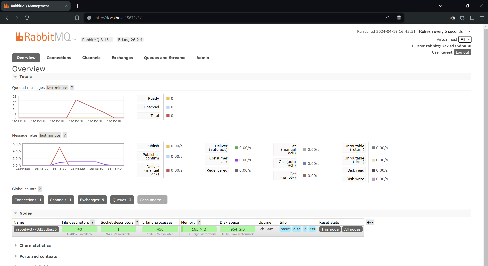
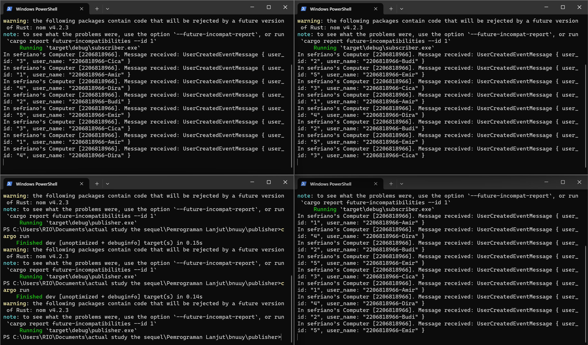
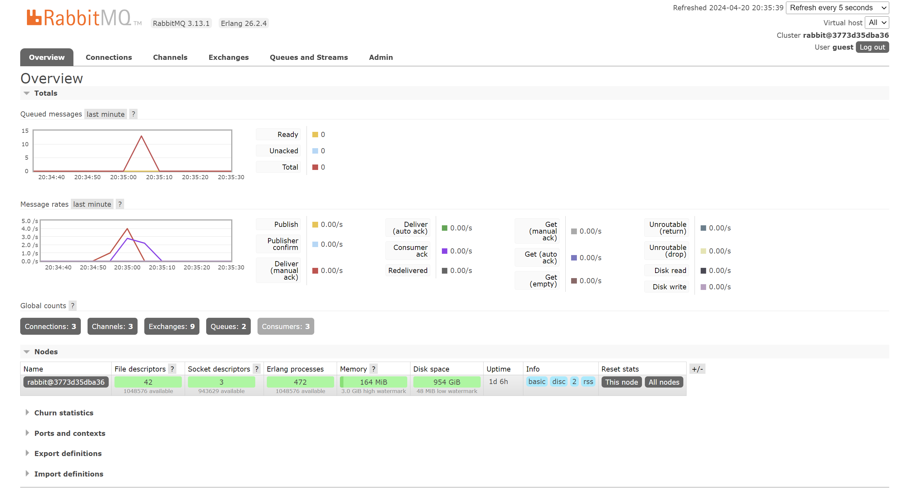

# advprog8-subscriber

bnuuy

## relfeceton

> 7a. what is amqp?

AMQP or Advanced Message Queuing Protocol, is an application layer protocol for Message-oriented middleware.
AMQP is used for communication between systems using messages, like between a Publisher and a Subscriber.

The protocol defines a message broker, which facilitates the connection between the Publisher and the Subscriber.
The Publisher sends a message to the exchange of the message broker.
Then, the message is routed based on bindings to the specified queues.
Finally, if the Subscriber subscribes to a queue, then the message is automatically delivered to the Subscriber.
They can also poll directly to a queue to receive a message, although this is discouraged. 

RabbitMQ uses AMQP 0.9.1 as its basis.

> 7b. what it means? **guest:guest@localhost:5672**, what is the first quest, and what is the second guest, and what is localhost:5672 is for?

Based on [RabbitMQ URI scheme](https://www.rabbitmq.com/docs/uri-spec#the-amqp-uri-scheme), 
- The first and second "guest" refers to the username and password respectively,
which is used to authenticate clients to the RabbitMQ service.
- `localhost:5672` is the IP address and port that RabbitMQ listens to by default.

This means that `guest:guest@localhost:5672` is connected to the RabbitMQ message broker securely using authentication.

### slow mo

In this case, I send 25 messages.

At first, the Total amount of queued messages goes up fast (average of 5/s (25 messages in 5 seconds) - 1/s (subscriber throughput) = 4/s) until the Publisher stops sending messages.
Then it goes down by 1/s (subscriber throughput) until it goes through all the messages.

### multi subscriber

In this case, I send 25 messages, with 3 subscriber programs (see connections in rabbitmq)

As before, the queued message goes up fast, but because of the 3 subscriber programs, it goes down relatively quickly.
In this example, it goes up by 5 - 3 = 2/s (5/s from before, 3/s from 3*1/s subscriber throughput).
Then, after all the messages are queued, it goes down by 3/s (subscriber throughput).
This is faster than the previous example, because the multiple machines are able to process the messages in parallel to each other, making it an example of horizontal scaling.

There is more that can be done, which is implementing multithreading in the `handle` function in the subscriber program, which is able to improve throughput as seen in [Tutorial 6](https://github.com/riorio805/rust-shoppers).
